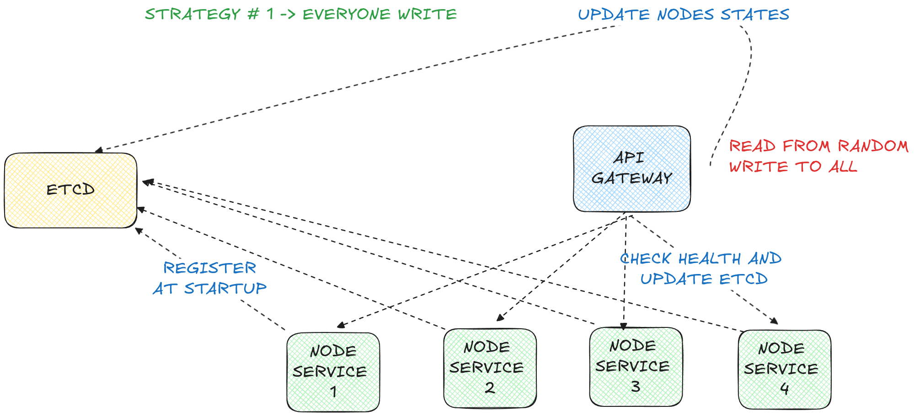

# TODO:

  * make more tests
    * ~~e2e?~~
  * refactor existing code:
  * setup tear_up and tear_down register on replicas
  * START TO PLAY WITH CONSENSUS ALGORITHM:
    * ~~post -> everyone write~~